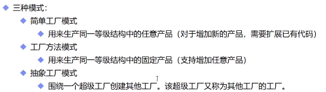
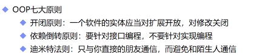
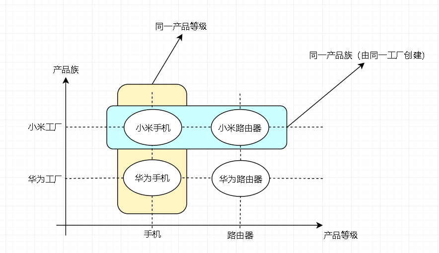
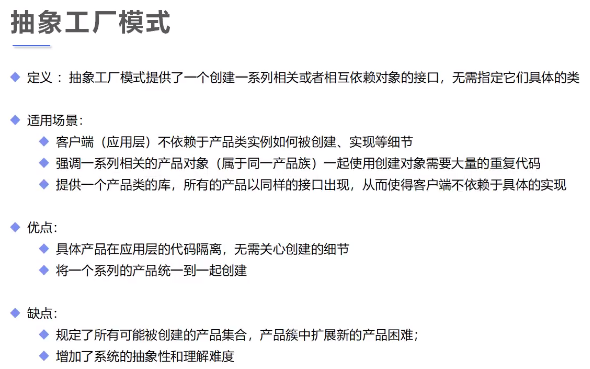
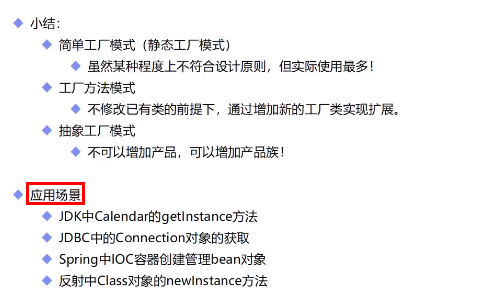

# 工厂模式
## 核心本质
- 实例化对象不使用new，用工厂方法代替
- 将选择实现类、创建对象 统一管理和控制，从而将调用者跟实现类解耦

## 对比简单工厂模式和工厂方法模式
### 简单工厂模式：只有一个工厂类，类中有生产的静态方法，用户通过调用工厂类静态方法获得产品。
### 工厂方法模式：提供工厂接口，接口中有返回产品的方法，每一种产品有对应的工厂实现，用户通过调用具体工厂获得产品。
 简单工厂模式优缺点: 优点是简单工厂模式实现了生成产品类的代码跟客户端分离，在工程类里面可以添加所需生成产品的逻辑。缺点是每次增加一种算法类型，都需要修改工厂类，不符合开闭原则

 工厂方法模式优缺点：优点是符合开闭原则，缺点就是当新增产品过多的时候，需要定义很多产品对应的工厂类。
### 二者区别：简单工厂只有三个要素，没有工厂接口，并且得到产品的方法一般是静态的。因为没有工厂接口，所以在工厂实现的扩展性方面稍弱，可以工厂方法模式的简化版
- 结构复杂度: simple（优）
- 代码复杂度: simple（优）
- 编程复杂度: simple（优）
- 管理复杂度: simple（优）

根据设计原则： 工厂方法模式

根据实际业务： 简单工厂模式

## 抽象工厂

### 抽象工厂中，有生产不同产品等级（手机，路由器）的方法声明，具体工厂只需实现抽象工厂接口，实现其中的方法，进行生产，形成自己的产品族（小米手机，小米路由）

### 客户访问任何工厂，就可拿到该工厂的产品。

