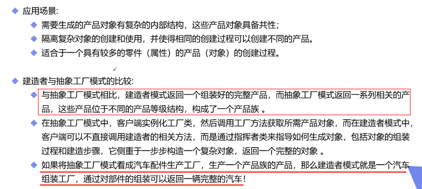

# 作用：在用户不知道具体的对象创建过程和细节情况下，完成对复杂对象的创建
# 适用于创建具有较多共同点，组成部分相似的产品。实现建造和表示分离，实现了解耦。将创建步骤分离，使创建过程清晰

## 一、常规用法如下

### 首先是有一个产品类Product，拥有各种产品属性

### 有一个抽象建造类Builder，类中有各种建造方法，有一个得到产品的get方法

### 然后有具体的工人类Worker，继承这个建造类，实现所有的建造方法（没错，他就是工具人）

### 然后是总指挥类Director类，有一个建造产品的方法，参数传入工具人，在方法中操作工具人实现具体方法进行生产

## 二、去掉Director角色，直接由Worker主导生产。

