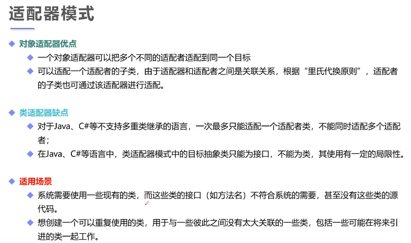

# 适配器模式

## 适配器模式(Adapter Pattern)：将一个接口转换成客户希望的另一个接口，使接口不兼容的那些类可以一起工作，其别名为包装器(Wrapper)。适配器模式既可以作为类结构型模式，也可以作为对象结构型模式。
### 在对象适配器模式中，适配器与适配者之间是关联关系；在类适配器模式中，适配器与适配者之间是继承（或实现）关系。

在对象适配器模式结构图中包含如下几个角色：

●Target（目标抽象类）{本例中的电脑}：目标抽象类定义客户所需接口，可以是一个抽象类或接口，也可以是具体类。

●Adapter（适配器类）{本例中的转接口}：适配器可以调用另一个接口，作为一个转换器，对Adaptee和Target进行适配，适配器类是适配器模式的核心，在对象适配器中，它通过继承Target并关联一个Adaptee对象使二者产生联系。

●Adaptee（适配者类）{本例中的网线}：适配者即被适配的角色，它定义了一个已经存在的接口，这个接口需要适配，适配者类一般是一个具体类，包含了客户希望使用的业务方法（电脑希望联网），在某些情况下可能没有适配者类的源代码。

