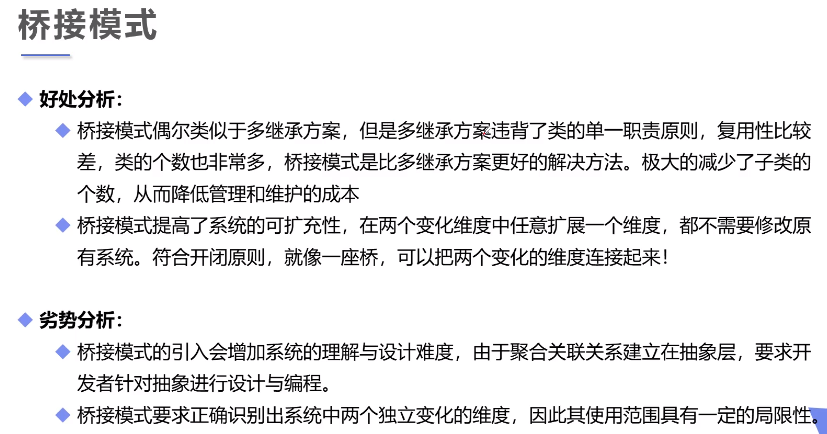
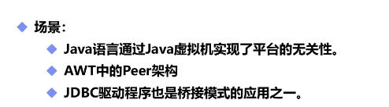

# 桥接模式

## 一个类两个独立变化的维度，为了降低耦合度，对两个不同的维度提取抽象类和实现类接口，并建立一个抽象关联关系。
### 本例中，将电脑品牌抽象为一个接口，将电脑抽象为一个抽象类，把电脑品牌 组合 进电脑抽象类中作为一个电脑属性，各种款式电脑继承电脑抽象类后再有各自的实现，便有了品牌属性

优点：
- 分离抽象接口及其实现部分。桥接模式使用“对象间的关联关系”解耦了抽象和实现之间固有的绑定关系，使得抽象和实现可以沿着各自的维度来变化，从而获得多维度组合对象。
- 桥接模式提高了系统的可扩展性，在两个变化维度中任意扩展一个维度，都不需要修改原有系统，符合“开闭原则”。

